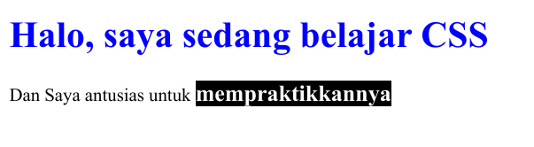
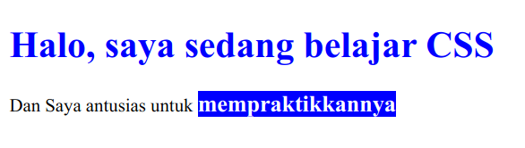

Untuk memperdetil pemahaman pada CSS, mari kita pahami dulu bagian-bagian dari syntax CSS. ada apa saja sih?

## Bagian-bagian dari CSS


## Selector

Selector berfungsi untuk memilih *element* mana yang hendak kita beri *style*. Pada bab-bab sebelumnya, kita telah menggunakan selector `b`. Nah apa saja sih yang bisa kita tuliskan pada selector ini? apa hanya `b` saja? Tentu tidak.

Selector bisa dituliskan dengan nama tagnya, misal: `h1`, `b`, `div`, `p`, dll. Bisa juga dituliskan dengan nama `class`-nya. selector `class` diawali dengan tanda (`.`) Mau tau? yuk praktik yuk.

Buka file `santuy.css` lalu tambahkan beberapa baris ini:

```css
/* 
  file location: belajar-santuy/santuy.css 
*/

b {                              
  background: #6E75A8;           
  color: white;  
  font-size: 20px;                
}

.hitam-putih {
  background: black;
  color: white;
}
```

Lalu edit file `index.html` dengan menambahkan kelas hitam putih pada *element* `b`. seperti dibawah ini:

```html
<!-- file location: belajar-santuy/index.html -->

<!DOCTYPE html>
<html lang="en">
  <head>
    <title>Belajar CSS santuy</title>
  </head>
  <body>
    <h1 style="color: blue;">Halo, saya sedang belajar CSS</h1>
    <div>Dan Saya antusias untuk <b class="hitam-putih">mempraktikkannya<b></div>
  </body>
</html>
```

Maka dilayar akan muncul




## Prioritas Aturan Pada CSS

Jika diperhatikan hasilnya, yang berubah hanyalah `background` dan `color` nya saja. sedangkan ukurannya tetap pada ukuran `20px`. Hal ini dikarenakan CSS sifatnya *cascading* (menurun), jadi satu element bisa memiliki beberapa aturan CSS sekaligus.

Apabila kita perdetil prosesnya, yang terjadi adalah seperti berikut.

```html
<b>mempraktikkannya</b>
```

Element diatas akan berwarna UNGU, karena sesuai dengan aturan blok pertama yaitu:

```css
b {                              
  background: #6E75A8;           
  color: white;  
  font-size: 20px;                
}
```


Sedangkan jika ditambahkan class
```html
<b class="hitam-putih">mempraktikkannya</b>
```

Maka dia akan berwarna **HITAM**, kenapa tidak ungu? karena **aturan css yang paling BAWAH adalah yang diprioritaskan**. Maka aturan CSS yang berlaku pada element tersebut adalah

```css
b {                              
  [X] background: #6E75A8; --> Kalah prioritas           
  [X] color: white; --> Kalah prioritas
  font-size: 20px;                
}

.hitam-putih {
  background: black;
  color: white;
}
```

Jika disatukan menjadi satu block saja, maka aturan yang berlaku bisa ditulis sebagai berikut:

```css
{                              
  font-size: 20px;     
  background: black;
  color: white;           
}

```

Hal ini **bukan** berarti blok aturan CSS yang pertama **tidak berlaku sama sekali**. Karena tidak ada aturan yang mengalahkan prioritas aturan `font-size: 20px`, maka aturan `font-size` tetap diterapkan pada element.

Untuk memperdalam pemahaman, mari kita coba membuat blok aturan baru lagi. Kali ini menggunakan selector `id`. cirinya diawali dengan tanda `#`.


```css
...

#background-biru {
  background: blue;
}
```

Tambahkan attribute `id` pada element `b` kita.

```html
<b id="background-biru" class="hitam-putih">mempraktikkannya</b>
```

Maka tampilan yang dihasilkan adalah sebagai berikut:



See? hanya warna backgroudnya saja yang berubah. Sedangkan `font-size`, dan `color`-nya tetap sesuai pada aturan-aturan sebelumnya. Jika diperjelas, maka aturan yang berlaku pada *element* ini adalah:

```css
b {                              
  [X] background: #6E75A8; --> Kalah prioritas           
  [X] color: white; --> Kalah prioritas
  font-size: 20px;                
}

.hitam-putih {
  [X] background: black; --> Kalah Prioritas
  color: white;
}

#background-biru {
  background: blue;
}
```

Jika disatukan menjadi satu block saja, maka aturan yang berlaku bisa ditulis sebagai berikut:

```css
{                              
  font-size: 20px;     
  color: white;  
  background: blue;
}
```

Mudah kan yaa? Semoga paham :(

## Macam-Macam Selector

Jika teman-teman membaca dari awal hingga sub chapter ini, sebenarnya kita telah mempelajari dan mempraktikkan beberapa macam selector basic yang ada di CSS. yaitu:

| Nama  | Tanda |  Contoh | Penjelasan |
|------ |-------|---------|------------|
| tag   | `nama-tag` | `h1 {}` | Styling pada element `<h1>`|
| class | `.`   | `.halo {}` | Styling pada element dengan *attribute* `class="halo"`|
| id | `#`   | `#hai {}` | Styling pada element dengan *attribute* `id="hai"`|


## Property

Ada banyaaaaaaak sekali macam-macam `property` pada css. `property` ini fungsinya untuk menentukan, sebenernya mau diapain sih *element*-nya? mau diberi warna latar belakang kah, atau diganti warna teksnya kah, atau diatur jenis dan ukuran fontnya kah? atau memberi garis disekeliling elemennya?

Begitu banyak pilihan `property` css yang bisa kita gunakan. Tapi tidak akan dibahas disini satu persatu karena bakalan panjang banget. Tapi hingga sub bab ini, kita telah belajar menggunakan beberapa `property` yaitu:

| Nama | Fungsi |
|------|--------|
|`color`| Untuk mengubah warna teks |
| `background`| Untuk mengubah latar belakang teks |
| `font-size` | Untuk mengubah ukuran teks |

`property` digunakan untuk menjawab pertanyaan:

> Apanya yang mau distyling dari element?

## Value

Value juga bisa beragam bentuknya. Bisa berbentuk angka, hexacode, teks string biasa. hingga opsi-opsi khusus yang terbatas. Sampai sini kita telah menggunakan 2 jenis `value` yaitu:

| Jenis | Contoh | Keterangan |
|-------|--------|------------|
| Angka | `20px`, `2rem`, `1em`, `100%` | Biasanya digunakan untuk mendefinisikan suatu ukuran. |
| Warna | `black`, `#FFF`, `rgba(0,0,125,1)` | Digunakan untuk mendefinisikan warna. | 

`value` digunakan untuk menjawab pertanyaan:

> Bagaimana stylingnya?

Misal mau membesarkan ukuran teks, tugas value adalah menjawab pertanyaan

> Seberapa besar ukurannya?

Atau saat mewarnai suatu element

> Bagaimana warnanya?

Atau opsi-opsi khusus seperti pada property `text-align`

> Mau rata apa? left, right, center, atau justify?

Hal ini dikarenakan pada aturan `text-align` hanya menerima 4 opsi `value` saja. Jadi kita tidak boleh asal-asalan ngisinya. contoh:

```css
{
  text-align: center; /* BOLEH */
  text-align: right; /* BOLEH */
  text-align: left; /* BOLEH */
  text-align: justify; /* BOLEH */

  text-align: kiri; /* GAK BOLEH WOI */
}
```

Jadi setiap value dari property bisa jadi unik dan berbeda. Pastikan teman-teman melihat contoh cara menggunakannya di internet. Akan saya beri satu contoh lagi yaitu `border` diisi dengan urutan 

```
border: ukuran<spasi>jenis_border<spasi>warna;
```

```css
border: 2px solid blue; /* BOLEH */

/* BOLEH, tapi gak keliatan warnannya */
border: 2px solid; 

/* Atau bisa dipisah satu-satu */
border-width: 2px;
border-style: solid;
border-color: blue;
```

Bab ini agak sedikit lebih panjang yaa? yaaa karena pada bab ini kita belajar prioritas CSS yang menurut saya penting untuk diketahui. Semangat terus yaak. Kalau mau rehat, boleh lho. Tapi kalau mau lanjut, silahkan ke next chapter~
