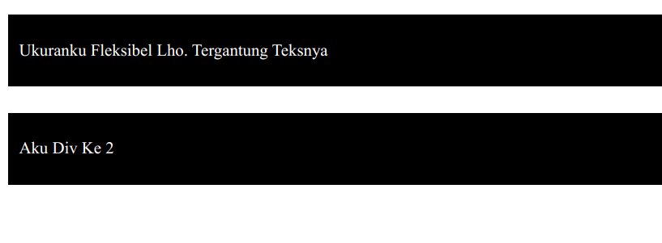
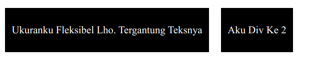
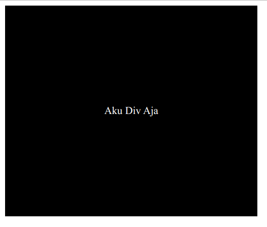

## Berkenalan Dengan `<div>`

`<div>` Merupakan element netral yang menjadi andalan para *frontend developer*. Kenapa? karena div ini mudah untuk distyling dan memiliki behaviour yang mudah diprediksi. Maksudnya gimana? hmm.. agak teknis sih. tapi untuk saat ini, mari kita sederhanakan. Intinya: `<div>` adalah *element* netral yang bisa kita gunakan untuk *styling*.

Maksudnya netral adalah, `<div>` ini tidak berpengaruh pada SEO. Selain itu, dia tidak memiliki default styling yang rumit seperti misalnya `<h1>` mempunyai default styling yaitu `font-size` nya besar. Kalau `<div>` enggak, dia netral. Mangkannya lebih mudah untuk distyling.


## Membentuk Paradigma

Membentuk paradigma tentu bukanlah suatu hal yang mudah, tapi saya akan ceritakan bagaimana paradigma saya saat melakukan styling CSS—Khususnya saat menggunakan `<div>`.

Jadi saya selalu membayangkan bahwa `<div>` adalah sebuah kotak berbentuk 2D yang bisa diwarnai, diberi ukuran, diberi jarak, dan diberi konten didalamnya. kotak 2D ini bisa dihiasi juga dengan shadow, bisa juga dipotong hingga berbentuk segitiga, lingkaran, oval, dll.

Hanya saja defaultnya kotak 2D ini tidak memiliki garis, tidak memiliki ukuran. saking kecilnya—jika tidak diberi ukuran—maka saat kita hanya menuliskan 

```html
<body>
  <div style="background: black;"></div>
</body>
```

tidak akan tampil apapun di browser. yaa karena div ini belum diapa-apain. Berbeda jika kita mulai memberinya ukuran misal:

```html
<head>
  <style>
    div {
      background: black;
      width: 100px;
      height: 100px;
    }
  </style>
</head>
<body>
  <div></div>
</body>
```

maka muncul seperti gambar di bawah ini:


## Mengenal Paddding

Atau jika kita tidak ingin memberi ukuran secara spesifik atau mengikuti ukuran konten yang ada didalamnya, maka bisa ditambahkan text dan padding seperti berikut:

```html
<head>
  <style>
    div {
      background: black;
      color: white;
      padding: 25px 10px;
    }
  </style>
</head>
<body>
  <div>Ukuranku Fleksibel Lho. Tergantung Teksnya</div>
</body>
```


## Mengenal Margin

Selain bisa memberinya ukuran, kita juga bisa memberinya jarak menggunakan `margin`.

```html
<head>
  <style>
    div {
      background: black;
      color: white;
      padding: 25px 10px;
      margin-bottom: 25px;
    }
  </style>
</head>
<body>
  <div>Ukuranku Fleksibel Lho. Tergantung Teksnya</div>
  <div>Aku Div Ke 2</div>
</body>
```




## Mengenal Display Mode

> Tapi itu kok melebar banget ya mas?

Iya, karena element `<div>` defaultnya memenuhi ruangan. ini dikarenakan default stylingnya memiliki aturan `display: block;`. Tinggal kita ganti aja.

```html
<head>
  <style>
    div {
      background: black;
      color: white;
      padding: 25px 10px;
      margin-bottom: 25px;

      /* PERHATIKAN INI */
      margin-right: 15px; 
      display: inline-block;
    }
  </style>
</head>
<body>
  <div>Ukuranku Fleksibel Lho. Tergantung Teksnya</div>
  <div>Aku Div Ke 2</div>
</body>
```

Jadilah seperti ini.



Naah ini baru benar-benar fleksibel menyesuaikan konten yang ada di dalamnya.


# Perbedaan Padding dan Margin

Sebenernya sudah saya coba jelaskan diatas, tapi kalau masih ada yang bingung, margin digunakan untuk memberi jarak antar element. Jadi jarak antara `div` satu dan `div` lainnya adalah efek dari `margin`.

Sedangkan `paddding` adalah jarak antara garis terluar `div` dengan konten yang ada di dalamnya. Mau lebih diperjelas lagi?. Mari lihat contoh di bawah ini:

```html
<head>
  <style>
    div {
      background: black;
      color: white;
      padding: 150px;
      display: inline-block;
    }
  </style>
</head>
<body>
  <div>Aku Div Aja</div>
</body>
```

hasilnya akan seperti dibawah ini:



perhatikan baik-baik jarak antara garis terluar elemen dan konten yang ada di dalamnya.

Bab ini cukup penting, karena disini kita harus membuat pemahaman tentang apa itu `<div>` dan stylingnya di CSS. Kalau saya pribadi, menganggap setiap *element* adalah sebuah kotak 2D.