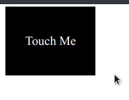
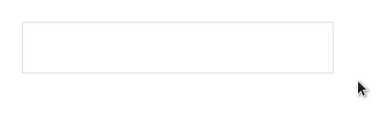
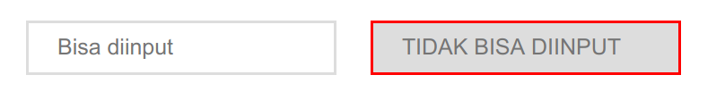

Nah, kerennya adalah... eh ga tau juga sih, ini sebenernya keren atau malah bikin pusing. Di CSS kita bisa menggunakan semacam "advance selector". Maksudnya gimana sih? yaa maksudnya tuh tidak sesederhana cuman select tag, class, ataupun id saja. Melainkan bisa dikombinasikan.

## Selector Kombinasi

Misal nih kita hendak melakukan select pada element `div` dengan class `content` dan id `first-post`. Kalau digambarkan dalam codingan kira-kira seperti ini bentuk elementnya.

```html
<div class="content" id="first-post">
  Ini First Post
</div>
<div class="content" id="second-post">
  Ini Second Post
</div>
```

Maka cara menuliskan selector yang sangat spesifik pada first post saja adalah sebagai berikut:

```css
div.content#first-post {}
```

atau bisa disederhanakan menjadi

```css
.content#first-post {}
```

Mari kita coba menuliskannya secara lengkap.

```html
<head>
  <style>
    .content {
      padding: 25px 15px;
      font-size: 1.2rem;
    }

    .content#first-post {
      background: #f2f2f2;
      border: 1px solid #DDD;
    }
  </style>
</head>
<body>
  <div class="content" id="first-post">
    Ini First Post
  </div>
  <div class="content" id="second-post">
    Ini Second Post
  </div>
  <div class="content" id="third-post">
    Ini Third Post
  </div>
</body>
```

Hasilnya akan sebagai berikut:


Pada gambar diatas yang berbeda hanyalah post pertama. ini karena kita melakukan styling tambahan khusus untuk post dengan `id="first-post"`.

Sederhananya, cara mengombinasikan CSS bisa dengan menempelkannya langsung. Berikut beberapa contoh lainnya.

```css
.halo.hai#mantab {}
#kuy#kita#belajar {}
h1.title-page#first-post {}
...
dst.
```

## Multi Selector

Selain dikombinasikan, kita juga bisa melakukan styling **beberapa selector dalam 1 block sekaligus**. Misal:

konten HTML:

```html
<a href="#" class="prev-link">Prev</a>
<a href="#" class="next-link">Next</a>
```
konten CSS

```css
.next-link, .prev-link {
  display: inline-block;
  padding: 10px 15px;
  background: green;
  color: white;
  font-family: sans-serif;
  text-align: center; 
  margin: 15px 10px;
}
```

Maka hasilnya akan seperti ini:


Cara menggunakan multi selector CSS yaitu dengan memisahkan masing-masing selector dengan tanda koma (`,`).


## Nested Selector

Nested selector memungkinkan kita untuk melakukan styling pada element berdasarkan parentnya. Gimana tuh maksudnya? Jadi gini Semisal kita punya link list yang strukturnya seperti ini.

```html
<div class="menu-list">
  <span><a href="#">Home</a></span>
  <span><a href="#">Profile</a></span>
  <span><a href="#">About</a></span>
  <span><a href="#">Blog</a></span>
</div>

<p>Ini paragraph hanya sebagai <a href="#">figuran</a></p>
```

Karena sesuatu dan lain hal, saya tidak mau menambahkan attribute tambahan pada element `<a>`, tapi saya mau styling element `<a>`-nya. Gimana dong? Caranya...

```css
.menu-list {
  margin: 0;
  padding: 0;
  width: 250px;
}

.menu-list span a {
  display: block;
  padding: 10px 15px;
  background: purple;
  color: white;
  border-bottom: 1px solid white;
}
```

Hasilnya akan seperti di bawah ini:


Hanya link yang mempunyai *parent* `class="menu-list"` saja yang berwarna ungu. Sedangkan link di bagian bawah (yaitu di dalam paragraf) tidak terpengaruh, walaupun sama-sama *element* `<a>` biasa tanpa tambahan class atau apapun.

Nah mari kita bereksperimen dengan menambahkan `class="menu-list"` pada element `<p>`. Kita lihat apa yang akan terjadi.

```html
<div class="menu-list">
  <span><a href="#">Home</a></span>
  <span><a href="#">Profile</a></span>
  <span><a href="#">About</a></span>
  <span><a href="#">Blog</a></span>
</div>

<p class="menu-list">Ini paragraph hanya sebagai <a href="#">figuran</a></p>
```

Coba tebak apa yang terjadi? yang terjadi adalah sebagai berikut:


Yaps! Link figuran tetap tidak berubah. Mengapa? karena syaratnya selain menjadi child dari `class="menu-list"`, link juga harus menjadi child dari element `<span>`. Jadi harus satu kesatuan guis, tidak bisa terpisahkan satu sama lain. asek~

Mari kita coba tambahkan `<span>`.

```html
<div class="menu-list">
  <span><a href="#">Home</a></span>
  <span><a href="#">Profile</a></span>
  <span><a href="#">About</a></span>
  <span><a href="#">Blog</a></span>
</div>

<p class="menu-list">Ini paragraph hanya sebagai <span><a href="#">figuran</a></span></p>
```

Tadaaaa!


# Select Immediate Children (`>`)  

Berikutnya mirip dengan nested, tapi ini lebih spesifik pada childrennya di bawahnya secara langsung. Misal nih:

konten HTML:

```html
<div class="level-1">
  <div>Level 2</div>
  
  <div>
    <div>Level 3</div>
  </div>

  <div>Level 2</div>

  <div>
    <div>Level 3</div>
  </div>
</div>
```

Konten CSS:

```css
div {
  border: 2px solid black;
  padding: 25px;
}

.level-1 > div {
  border: 2px solid red;
}
```

Hasilnya akan seperti ini:


Custom styling yang kita lakukan pada masing-masing div adalah memberinya garis hitam. Namun perbedaan yang mencolok adalah garis merah pada level 2 dan level 3. Hal ini dikarenakan ada rule khusus untuk div level 2 yang secara hirarki berperan sebagai `immediate children` dari element dengan `class="level-1"`.

Mengapa garis level 3 tidak berwarna merah? yaa karena dia bukan `immediate children` dari `class="level-1"` melainkan dia adalah `immediate children` dari element `class="level-2"`. Yuk kita coba eksperimen lagi.

```css
div {
  border: 2px solid black;
  padding: 25px;
}

.level-1 div {
  border: 2px solid red;
}
```

Tebak apa yang terjadi?


Jika kita menghapus tanda (`>`) maka **semua div yang ada di dalam element** `class="level-1"` akan terpengaruh dan memiliki garis merah.


## Interaction

Sebenernya namanya adalah *pseudo selector* yang memungkinkan kita menambahkan detil interaksi-interaksi kecil pada laman web kita. Interaksi misalnya saat mouse berada di atas element, maka element berganti warna. Mau cobain? Kuy.

Konten HTML:

```html
<div class="my-element">Touch Me</div>
```

Konten CSS:

```css
.my-element {
  padding: 35px 25px;
  display: inline-block;
  background: black;
  color: white;
}

.my-element:hover {
  background: blue;
}
```

Maka kita bisa melakukan interaksi dengan element seperti gambar dibawah ini:



Efek ini namanya adalah efek hover guis. Hover adalah interaksi saat user mengarahkan kursornya di atas suatu *element*.

## Transition

Nah itu kan agak sedikit kaku yaa efeknya? kita bisa lho membuatnya lebih smooth dalam proses transisinya. Bagimana caranya? kita tambahkan aturan `transition`. seperti ini.

```css
.my-element {
  padding: 35px 25px;
  display: inline-block;
  background: black;
  color: white;
  transition: all 0.5s ease-out;
}

.my-element:hover {
  background: blue;
}
```

Hasilnya


Lebih smooth kan perubahan warnannya? izinkan saya menjelaskan secara detail maksud dari syntax transition.

##### `transition`

Untuk mengadakan efek transisi pada suatu element.

##### `all`

`all` adalah perubahan apa yang hendak kita beri efek transisi? Sebenernya kita bisa juga menulis `background` karena yang kita ubah atau kita beri efek transisi hanyalah pada perubahan `background`-nya. Tapi saya pribadi lebih sering menggunakan `all`.

##### `0.5s`

`0.5s` adalah durasi transisi. Ditulis dalam satuan *seconds*. Guna menentukan seberapa cepat pergantian warnanya. Coba eksperimen ganti durasinya jadi `2s`. Maka akan menghasilkan transisi perubahan warna yang lebih lama.

##### `ease-out`

`ease-out` ini adalah *timing function*. gimana yaa ngejelasinnya. Sebenarnya ini *optional* (tidak harus ditulis). Jika kita tidak menuliskan *timing function*, maka kita akan mendapatkan default *timing function* yaitu `linear`. yang artinya transisi berjalan secara `linear`. Sedangkan jika `ease-out`, transisi akan lamban di awal, kemudian makin cepat pada bagian akhir. Hmm... agak rumit menjelaskannya.


## Input Interaction

Selain sentuhan (hover), kita juga bisa memberi efek pada saat user focus pada suatu input. Maksudnya gimana? yuk mari kita coba.

Konten HTML:

```html
<input type="text" placeholder="Coba fokus disini" />
```

Konten CSS

```css
input {
  margin-top: 15px;
  margin-left: 25px;
  border: 1px solid #DDD;
  padding: 10px 25px;
  font-size: 1.2rem;
}

input:focus {
  outline: none; /* Untuk menghilangkan garis biru */
  border: 2px solid brown;
}
```

Coba klik input text yang ada pada layar. Dan lihat apa yang berubah.




## Select By Attribute

Ini menarik, karena ada kasus dimana kita tidak ingin menambahkan class pada suatu element, dan hanya memenfaatkan attribute yang lain untuk dijadikan acuan. Contohnya adalah saat memberi tampilan pada inputan yang enable (bisa diinput) dan inputan yang disabled (tidak bisa diinput). Maka bisa dituliskan sebagai berikut:

Konten HTML:

```html
<input type="text" placeholder="Bisa diinput" />
<input type="text" placeholder="TIDAK BISA DIINPUT" disabled="disabled" />
```

Konten CSS:

```css
input {
  margin-top: 10px;
  margin-left: 25px;
  border: 2px solid #DDD;
  padding: 10px 25px;
  font-size: 1.2rem;
  outline: none;
}

input[disabled="disabled"] {
  border-color: red;
  background: #DDD;
}
```

Maka tampilannya akan seperti ini




Banyak banget yak chapter ini? Mulai bingung? gapapa ga harus paham sekarang.

