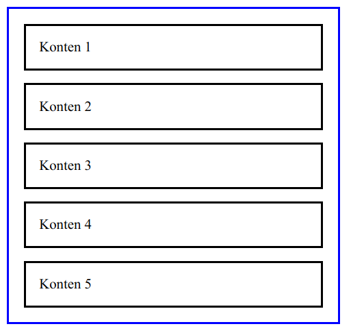
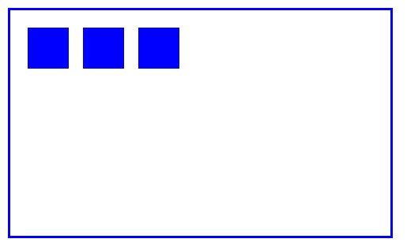
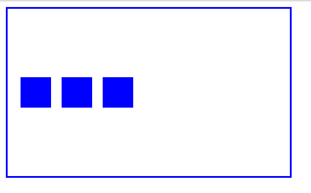
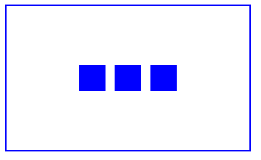

Saya cukup dilema, apa harus menjelaskan konsep `float` atau langsung saja `flex`? Hmmm... `flex` aja deh. Pada bagian ini teman-teman harus sedikit lebih fokus karena pemahaman konsep `flex` perlu konsentrasi yang lebih.

## Behaviour Default Dari Flex

Makin kita sering menggunakan suatu element ataupun suatu aturan tertentu, maka kita akan mengenali gimana sih defaultnya aturan ini? gimana sih defaultnya tampilannya element ini? ini yang bikin kita nggak kaget, semisal element satu dengan element yang lainnya memiliki "efek" style/tampilan yang berbeda walaupun aturannya sama.

Flex sendiri mempunyai default behavior yang sebagai berikut. Sambil praktik aja yaaa...

Konten CSS:

```css
.inside-flex {
  border: 2px solid black;
  padding: 15px;
  margin: 7px; 
}

.flex-container {
  width: 500px;
  border: 2px solid blue;
  display: flex;  
  padding: 10px;
}
```

Konten HTML:

```html
<div class="flex-container">
  <div class="inside-flex">
    Konten 1
  </div>
  <div class="inside-flex">
    Konten 2
  </div>
  <div class="inside-flex">
    Konten 3
  </div>
</div>
```

Hasilnya:


Yuk kita coba perinci apa saja behaviour dari flex. 

Untuk membuat suatu layout `flex`, dibutuhkan `container` (bagian terluar / garis biru) dan kontennya (bagian dalam / garis hitam). Ciri dari `container` adalah mempunyai aturan `display: flex;`, ini wajib. Sedangkan kontennya, tak harus memiliki aturan khusus.

## Auto Width

Menariknya adalah, `flex` ini bisa membuat kontennya memiliki ukuran yang fleksibel--sesuai namanya. Misal nih kita mau membuat kontennya memiliki ukuran yang sama besar, maka cukup seperti ini:

```css
.inside-flex {
  border: 2px solid black;
  padding: 15px;
  margin: 7px; 
  width: 100%; /* Kita tambahkan ini */
}

.flex-container {
  width: 500px;
  border: 2px solid blue;
  display: flex;  
  padding: 10px;
}
```

Hasilnya akan seperti ini:


> Lho 100% kok nggak full?

Iyaa... memang biasanya kalau kita menambahkan aturan `width: 100%;` maka hasilnya tiap konten akan memenuhi haris biru--semacam melebar gitu, memenuhi ruang yang ada. Tapi kali ini beda, karena konten tersebut berada di `container` flex. Jumlahnya pun gak harus 3, bisa tak terhingga. **karena `flex` akan menyesuaikan `width` dari kontennya secara otomatis**.

Mari kita tambahkan konten HTML:

```html
<div class="flex-container">
  <div class="inside-flex">
    Konten 1
  </div>
  <div class="inside-flex">
    Konten 2
  </div>
  <div class="inside-flex">
    Konten 3
  </div>
  <div class="inside-flex">
    Konten 4
  </div>
  <div class="inside-flex">
    Konten 5
  </div>
</div>
```

Hasilnya:


## Flex Wrap

> Tapi mas, saya maunya kontennya otomatis turun ke bawah saat sudah penuh, jadi ukurannya tetap proporsional.

Tenang, di `flex` ada yang namanya *wrapping*. Dengan menambahkan aturan `flex-wrap: wrap;` maka kita seolah-olah bicara ke containernya.

> Container, kalau nggak cukup, jangan dipaksa, diturunin aja. Oke?

Mari kita coba:

```css
.inside-flex {
  border: 2px solid black;
  padding: 15px;
  margin: 7px; 
}

.flex-container {
  width: 500px;
  border: 2px solid blue;
  display: flex;  
  padding: 10px;
  flex-wrap: wrap; /* Tambahkan ini */
}
```

Hasilnya:


Tuh kan konten nomor 5 otomatis turun. 

> Kok konten nomor 5 aja yang turun mas?

*Duh, sambat wae*. Oke kita coba kecilkan ukuran `container`-nya. Logikanya adalah, kalau `container` makin kecil, maka 1 baris gak akan cukup untuk 4 konten.

```css
.inside-flex {
  border: 2px solid black;
  padding: 15px;
  margin: 7px; 
}

.flex-container {
  width: 350px; /* Edit ini */
  border: 2px solid blue;
  display: flex;  
  padding: 10px;
  flex-wrap: wrap; 
}
```

Hasilnya:


Udah paham kan yaa fungsi `flex-wrap`?


## Flex Direction

`flex-direction` fungsinya untuk menentukan arah urutan konten dari flex. Maksudnya gimana sih? maksudnya gini, kalau kita lihat dari contoh sebelumnya, maka kontennya itu *urut dari kiri ke kanan*. Dimulai dengan konten nomor 1, 2, 3, 4, 5, dst. 

Defaultnya, akan diurutkan dari **kiri ke kanan**. Tapi kita bisa mengubahnya misal **dari atas ke bawah** seperti di bawah ini.

```css
.inside-flex {
  border: 2px solid black;
  padding: 15px;
  margin: 7px; 
}

.flex-container {
  width: 350px; 
  border: 2px solid blue;
  display: flex;  
  padding: 10px;
  flex-wrap: wrap; 
  flex-direction: column; /* Tambahkan ini */
}
```

Hasilnya



Untuk valuen dari `flex-direction` ini yang paling umum ada 4. yaitu: `column`, `row`, `column-reverse`, `row-reverse`.


## Align Items

Align items ini wajib banget dikuasai, saya malah menganggap ini adalah fitur paling top yang ada pada flexbox. Karena dengan aturan `align-items` kita bisa mengatur rata konten secara *vertical*. Eits, gimana sih mas? ga paham.

Maksudnya gini, kalau kita ngetik atau ngerjain tugas di **docs**, biasanya kita akan menemui pilihan untuk rata teks. Bisa rata kiri, rata kanan, maupun rata tengah. Nah konsepnya ini sama, tapi tidak secara horizontal melainkan secara vertikal.

Masih bingung? Hmm... kita coba aja deh.

Konten HTML:

```html
<div class="belajar-align-items">
  <div class="box"></div>
  <div class="box"></div>
  <div class="box"></div>
</div>
```

```css
.box {
  width: 40px;
  height: 40px;
  background: blue;
  margin: 7px; 
}

.belajar-align-items {
  width: 350px; 
  height: 200px;
  border: 2px solid blue;
  display: flex;  
  padding: 10px;
  flex-direction: row; /* ini wajib */
}
```

Hasilnya akan seperti ini:



Mari kita coba tambahkan aturan align-items pada flex containernya.

```css
.box {
  width: 40px;
  height: 40px;
  background: blue;
  margin: 7px; 
}

.belajar-align-items {
  align-items: center; /* Tambahkan ini */
  width: 350px; 
  height: 200px;
  border: 2px solid blue;
  display: flex;  
  padding: 10px;
  flex-direction: row; /* ini wajib */
}
```

Maka akan menghasilkan konten yang rata tengah secara vertikal seperti ini:




## Justify Content

Ini juga penting sih. Konsepnya mirip dengan `text-align`. Hanya saja yang diratakan bukanlah teks melainkan element. Kalau dengan `align-items` kita bisa meratakan secara vertical, maka dengan `justify-content` kita bisa meratakan konten secara horizontal. Mudahkan?

```css
.box {
  width: 40px;
  height: 40px;
  background: blue;
  margin: 7px; 
}

.belajar-align-items {
  justify-content: center; /* Tambahkan ini */
  align-items: center;
  width: 350px; 
  height: 200px;
  border: 2px solid blue;
  display: flex;  
  padding: 10px;
  flex-direction: row; /* ini wajib */
}
```

Maka hasilnya




## Latihan Layouting

4 Bagian tadi bisa dijadikan modal untuk memulai layouting. KIta bisa membuat layout sederhana dengan kompleks menggunakan flex. Mau tau? yuk kita coba membuat apa yaa.... Hmm... yuk kita coba bikin sebuah `navbar`.

Jadi navbar ini adalah navigasi yang berada diatas gitu. isinya menu-menu. Semacam peta agar user mudah untuk menjelajahi website kita.

Konten HTML

```html
<div class="navbar">
  <a href="#" class="logo">LOGO</a>

  <div class="menu-list">
    <a href="#" class="menu">Home</a>
    <a href="#" class="menu">Blog</a>
    <a href="#" class="menu">About</a>
  </div>
</div>
```

Konten CSS

```css
/* Block ini wajib yaa..  */
* {
  box-sizing: border-box;
}


.navbar {
  display: flex;
  background: #3F51B5;
  font-family: sans-serif;
  align-items: center;
  flex-direction: row;
  width: 100%;
}

.logo {
  display: block;
  font-size: 2rem;
  padding: 10px 15px;
  color: white;
  text-decoration: none;
  font-weight: bold;
}

.menu-list {
  display: flex;
  flex: 1; /* PERHATIKAN INI */
  justify-content: flex-end;
  padding-right: 15px;
}

.menu {
  display: block;
  padding: 7px 15px;
  color: white;
  background: #1db6ca;
  margin: 0 7px;
  text-decoration: none;
}
```

Hasilnya:


Lumayan panjang yaa? Yaa emang. Tapi mari kita coba perdetil lagi bagian-bagian dari navbar ini.

## Bagian-bagian dari Navbar

Element dengan class navbar ini berperan sebagai flex container. Kok bisa tau? yaa karena cirinya dia memiliki `display: flex`. Lantas apa saja kontennya? kontennya adalah `.logo` dan `.menu-list` saja. 

Lho? terus yang `.menu` itu ikut siapa? Element `.menu` itu child dari `.menu-list` yang artinya bukan termasuk wewenang dari flex container kita yaitu `.navbar` (karena bukan turunannya langsung). 

Mengapa ini penting, karena kalau kita mau styling flexbox, kita mesti paham dulu mana flex containernya, mana kontennya.

## `Flex: 1;`

Selanjutnya mari kita soroti pada bagian `flex: 1;` aturan ini bertujuan untuk menentukan bagian mana yang mendominasi. Mendominasi maksudnya adalah element atau konten mana yang berhak untuk menggunakan **sisa dari space di dalam flex container**.

Kita tau sendiri kalau `.navbar` punya 2 konten yaitu `.logo` dan `.menu-list`. Dan yang mendominasi adalah `menu-list` karena mempunyai aturan `flex: 1`. Kita coba *inspect element* nya yaa.


Bisa kita perhatikan dari gambar diatas, bahwa `.menu-list` mempunyai porsi yang lebih besar ketimbang `.logo`. Padahal sebenernya `.menu-list` hanya butuh space kecil untuk menampung 3 menunya tersebut.