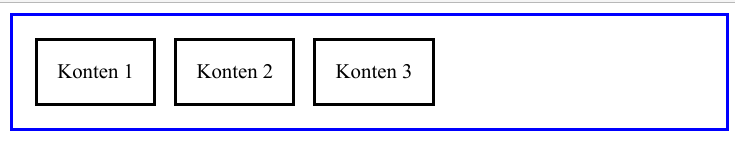
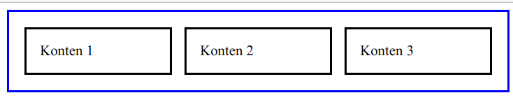
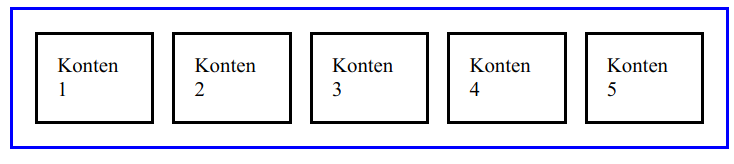
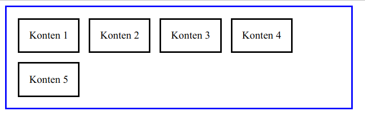
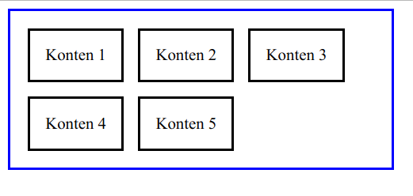

Saya cukup dilema, apa harus menjelaskan konsep `float` atau langsung saja `flex`? Hmmm... `flex` aja deh. Pada bagian ini teman-teman harus sedikit lebih fokus karena pemahaman konsep `flex` perlu konsentrasi yang lebih.

## Behaviour Default Dari Flex

Makin kita sering menggunakan suatu element ataupun suatu aturan tertentu, maka kita akan mengenali gimana sih defaultnya aturan ini? gimana sih defaultnya tampilannya element ini? ini yang bikin kita nggak kaget, semisal element satu dengan element yang lainnya memiliki "efek" style/tampilan yang berbeda walaupun aturannya sama.

Flex sendiri mempunyai default behavior yang sebagai berikut. Sambil praktik aja yaaa...

Konten CSS:

```css
.inside-flex {
  border: 2px solid black;
  padding: 15px;
  margin: 7px; 
}

.flex-container {
  width: 500px;
  border: 2px solid blue;
  display: flex;  
  padding: 10px;
}
```

Konten HTML:

```html
<div class="flex-container">
  <div class="inside-flex">
    Konten 1
  </div>
  <div class="inside-flex">
    Konten 2
  </div>
  <div class="inside-flex">
    Konten 3
  </div>
</div>
```

Hasilnya:



Yuk kita coba perinci apa saja behaviour dari flex. 

Untuk membuat suatu layout `flex`, dibutuhkan `container` (bagian terluar / garis biru) dan kontennya (bagian dalam / garis hitam). Ciri dari `container` adalah mempunyai aturan `display: flex;`, ini wajib. Sedangkan kontennya, tak harus memiliki aturan khusus.

## Auto Width

Menariknya adalah, `flex` ini bisa membuat kontennya memiliki ukuran yang fleksibel--sesuai namanya. Misal nih kita mau membuat kontennya memiliki ukuran yang sama besar, maka cukup seperti ini:

```css
.inside-flex {
  border: 2px solid black;
  padding: 15px;
  margin: 7px; 
  width: 100%; /* Kita tambahkan ini */
}

.flex-container {
  width: 500px;
  border: 2px solid blue;
  display: flex;  
  padding: 10px;
}
```

Hasilnya akan seperti ini:



> Lho 100% kok nggak full?

Iyaa... memang biasanya kalau kita menambahkan aturan `width: 100%;` maka hasilnya tiap konten akan memenuhi haris biru--semacam melebar gitu, memenuhi ruang yang ada. Tapi kali ini beda, karena konten tersebut berada di `container` flex. Jumlahnya pun gak harus 3, bisa tak terhingga. **karena `flex` akan menyesuaikan `width` dari kontennya secara otomatis**.

Mari kita tambahkan konten HTML:

```html
<div class="flex-container">
  <div class="inside-flex">
    Konten 1
  </div>
  <div class="inside-flex">
    Konten 2
  </div>
  <div class="inside-flex">
    Konten 3
  </div>
  <div class="inside-flex">
    Konten 4
  </div>
  <div class="inside-flex">
    Konten 5
  </div>
</div>
```

Hasilnya:




## Flex Wrap

> Tapi mas, saya maunya kontennya otomatis turun ke bawah saat sudah penuh, jadi ukurannya tetap proporsional.

Tenang, di `flex` ada yang namanya *wrapping*. Dengan menambahkan aturan `flex-wrap: wrap;` maka kita seolah-olah bicara ke containernya.

> Container, kalau nggak cukup, jangan dipaksa, diturunin aja. Oke?

Mari kita coba:

```css
.inside-flex {
  border: 2px solid black;
  padding: 15px;
  margin: 7px; 
}

.flex-container {
  width: 500px;
  border: 2px solid blue;
  display: flex;  
  padding: 10px;
  flex-wrap: wrap; /* Tambahkan ini */
}
```

Hasilnya:



Tuh kan konten nomor 5 otomatis turun. 

> Kok konten nomor 5 aja yang turun mas?

*Duh, sambat wae*. Oke kita coba kecilkan ukuran `container`-nya. Logikanya adalah, kalau `container` makin kecil, maka 1 baris gak akan cukup untuk 4 konten.

```css
.inside-flex {
  border: 2px solid black;
  padding: 15px;
  margin: 7px; 
}

.flex-container {
  width: 350px; /* Edit ini */
  border: 2px solid blue;
  display: flex;  
  padding: 10px;
  flex-wrap: wrap; 
}
```

Hasilnya:



Udah paham kan yaa fungsi `flex-wrap`?


## Flex Direction


## Align Items


## Justify Content