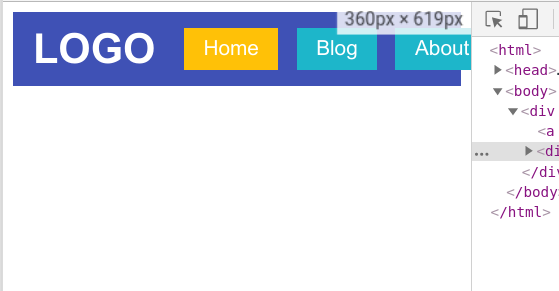
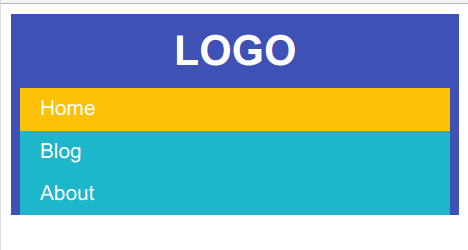

## Berkenalan Dengan Viewport

Nah sekarang bayangkan jika navbar kita di pasang di mobile devices yang ukuran layarnya kecil. Tentu hasilnya tidak akan elok kan? Cara lihatnya gimana? cara lihatnya teman-teman bisa:

```
- klik kanan pada element
- inspect element lalu klik tanda titik tiga (di ujung kanan atas) 
- ubah posisi devtools menjadi di sebelah kanan. 
```

Akan saya contohkan. Tapi agak berat nih GIF nya. Sabar yak.


Dengan devtools ini kita bisa melihat bagaimana tampilan website jika ada pada layar yang lebih kecil dengan cara menggeser-geser *viewport*  sehingga ukurannya berubah.

Saat menggeser, ada ukuran yang tertera di ujung kanan atas. Pas banget bersebelahan dengan devtools. Coba atur ukurannya hingga 360px. Seperti gambar di bawah ini.



## Ukuran Viewport

Nah bisa dilihat jika tampilan navbar kita mendadak jadi jelek saat diakses melalui layar dengan ukuran 360px. Sebenernya kenapa sih harus 360px? jadi 360px itu adalah ukuran rata-rata layar HP saat ini guis. Ukurannya bisa beragam, tapi untuk belajar, kita coba pada ukuran 360px dulu.

## Basic Responsive

Kita harus pikirin dulu, navbarnya bakalan digimanain kalau berada di layar yang lebih kecil? Nah solusi paling sederhana adalah mengubah susunan menunya, daripada dari kiri ke-kanan, kita ubah jadi dari atas ke bawah. Masih ingat kan dengan bab Flexbox? Yuk markicob.

File CSS

```css
/* Block ini wajib yaa..  */
* {
  box-sizing: border-box;
}


.navbar {
  display: flex;
  background: #3F51B5;
  font-family: sans-serif;
  align-items: center;
  flex-direction: row;
  width: 100%;
}

.logo {
  display: block;
  font-size: 2rem;
  padding: 10px 15px;
  color: white;
  text-decoration: none;
  font-weight: bold;
}

.menu-list {
  display: flex;
  flex: 1; /* PERHATIKAN INI */
  justify-content: flex-end;
  padding-right: 15px;
}

.menu {
  display: block;
  padding: 7px 15px;
  color: white;
  background: #1db6ca;
  margin: 0 7px;
  text-decoration: none;
}

.active {
  background: #ffc107;
}

/* Tambahkan ini */
@media only screen and (max-width: 365px) {
  .navbar {
    flex-direction: column;
  }  

  .menu-list {
    width: 100%;
    flex-direction: column;
    padding-right: 0;
  }
}
```

Maka hasilnya



> Lho mas, itu kok 365px? bukan 360px?

Jadi gini ceritanya, aturan tambahan tersebut **hanya berlaku** pada layar yang ukurannya **MAKSIMAL 365px**. 

Sedangkan layar yang kita targetkan berukuran 360px. itu artinya jika kita menuliskan `max-width: 360px` maka aturannya tidak akan ngefek, kecuali ukuran layarnya dikecilin lagi **KURANG DARI 360px**. 

Mengapa saya tambahkan `+5px`, agar stylingnya berpengaruh pada ukuran layar `360px` yang notabene **KURANG DARI 365px**.

Semoga paham yaa :(

## Responsiveness Testing

Lah terus? kalau tampilan di layar gedhenya jadi gimana? hmm.. gak tau ya, seharusnya sih tetep seperti yang awal. Mau tau cara ceknya? **yaa tinggal digeser** :')

Sini saya contohkan.


## Aturan Responsive

Nah yang bisa kita ubah tuh banyak, nggak cuman `flex-direction` saja. Background pun bisa, terserah mau diubah apanya, mau disembunyiin juga bisa via `display: none;`. Intinya tinggal menambahkan blok `@media`.

```css
@media only screen and (max-width: UKURAN_LAYAR_TARGET) {
  /* Tambahkan aturan disini */
}
```

Selain `max-width`, kita juga bisa kok menggunakan `width` biasa ataupun `min-width` tergantung selera dan cara orang masing-masing. Kalau saya pribadi lebih suka menggunakan `min-width` karena saya selalu mengusahakan mendesain mulai dari layar yang terkecil.

Anyway, teknik detilnya bisa dipelajarin sambil jalan. Pokoknya ngerti dan praktik dulu. Oke?

Gimana? gampang atau gampang? Gampang kan? CSS itu mudah :)
