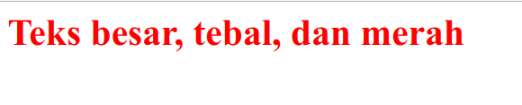
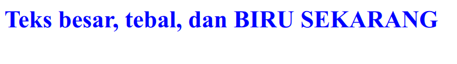
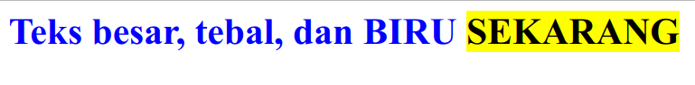
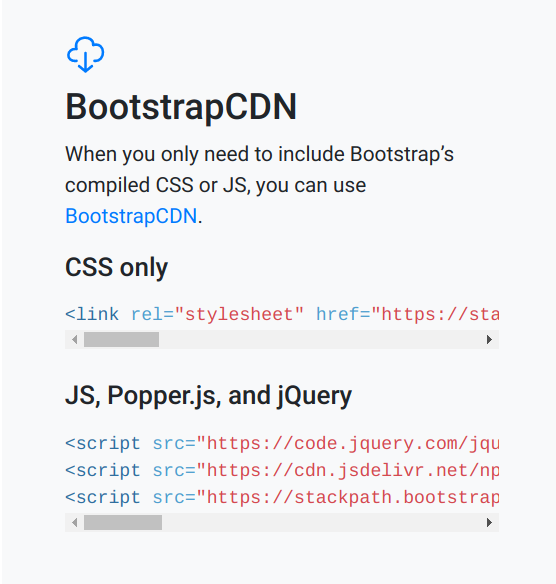
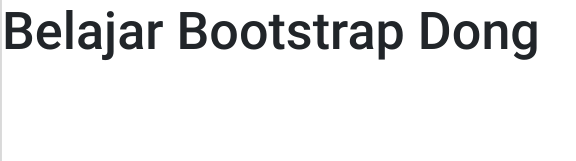
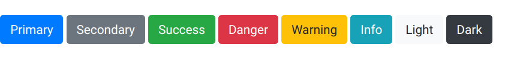
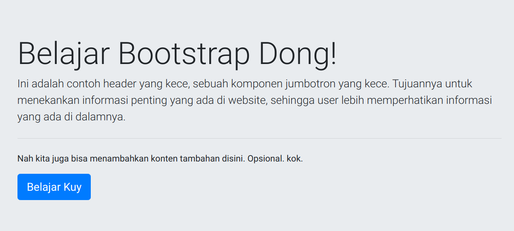
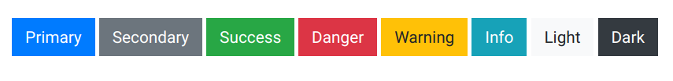
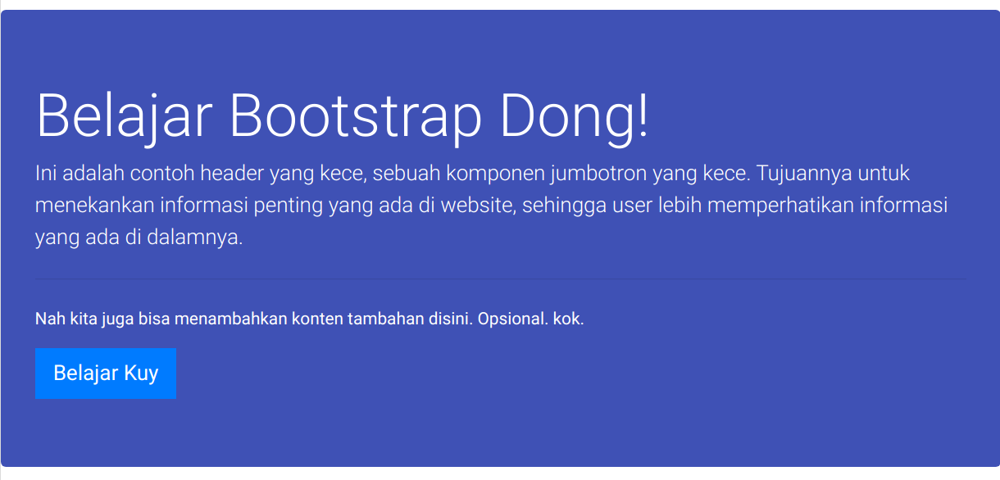

Jika pada bab sebelumnya saya mengatakan CSS itu mudah, maka pada bab ini "bisa jadi" lebih mudah lagi. karena kita akan berkenalan dengan framework. Asik toh?

## Apa Itu Framework

Framework secara general adalah adalah sesuatu yang memudahkan pekerjaan kita dan mempersingkat waktu pengerjaan (lebih hemat waktu). 

Kalau maksud dari framework CSS itu sendiri, teman-teman bisa bayangkan bahwa kita sudah disediakan banyak blok aturan CSS yang kita tinggal pakai. Tinggal tempelin ke element kita.

## Membuat Framework 

Misal nih yaa... mari kita coba bikin mini-framework ala ala. biar teman-teman bisa memahami konsepnya. Isi dari frameworknya itu sendiri seperti ini.

Buat file `framework.css`. Lalu isi dengan konten seperti di bawah ini:

```css
/**
  location: belajar-santuy/framework.css
*/

/* TEXT STYLE */
.text-bold {
  font-weight: bold;
}
.text-italic {
  font-style: italic;
}


/* TEXT COLOR */
.text-red {
  color: red;
}

.text-blue {
  color: blue;
}


/* TEXT SIZE */
.text-besar {
  font-size: 2rem;
}
.text-normal {
  font-size: 1rem;
}
.text-kecil {
  font-size: 0.8rem;
}

/* BACKGROUND */
.efek-stabilo {
  background: yellow;
  color: black;
}
```

Jika teman-teman perhatikan, susunan framework biasanya kecil-kecil gitu. Sehingga bisa digunakan secara bersamaan melalui konsep multi class dan bisa digunakan secara berulang (*reusable*). Mari kita coba mengimplementasikan frameworknya.

Buat file `index.html` (atau bisa diberi nama lain). Tambahkan konten di bawah ini

```html
<!-- Location: belajar-santuy/index.html -->

<!DOCTYPE html>
<html lang="en">
  <head>
    <title>Belajar Pakai Framework</title>
    <link rel="stylesheet" href="./framework.css">
  </head>
  <body>
    <!-- Letakkan element berikutnya disini -->
  </body>
</html>
```

Setelah itu mari kita coba membuat sebuah teks besar, tebal dan berwarna merah **TANPA MENAMBAHKAN ATURAN CSS**. Gimana caranya? gini:

```html
<body>
  <div class="text-besar text-bold text-red">Teks besar, tebal, dan merah</div>
</body>
```

Hasilnya



Menarik bukan? padahal kita tidak **menambahkan** satu aturan CSS pun selain yang kita tulis di awal tadi.

Mari kita coba ubah warnanya jadi biru.

```html
<body>
  <div class="text-besar text-bold text-blue">Teks besar, tebal, dan BIRU SEKARANG</div>
</body>
```

Hasilnya



Semisal kita hanya ingin mewarnai bagian "SEKARANG"-nya saja gimana? gampang, *tinggal pakai class yang ada*.

```html
<body>
  <div class="text-besar text-bold text-blue">
    Teks besar, tebal, dan BIRU <span class="efek-stabilo">SEKARANG</span>
  </div>
</body>
```

Hasilnya



Tuh kan berubah. Enaknya framework tuh kita cuman tinggal pakai class yang kita inginkan. Simpel kan? Sekarang mari kita coba menggunakan framework yang terkenal seperti bootstrap.


## Menginstall Framework

Untuk menginstall bootstrap, buka laman [https://getbootstrap.com/](https://getbootstrap.com/). Kemudian agak scoll ke bawah, pasang element yang ada di bagian "bootstrap CDN".



Tambahkan pada file HTML kita, pastikan HTML kita masih bersih yaa. Tambahkan konten seperti di bawah ini.

```html
<!doctype html>
<head>
  <!-- INI WAJIB BIAR GAK KACAU WAKTU DI HP -->
  <meta charset="utf-8">
  <meta name="viewport" content="width=device-width, initial-scale=1, shrink-to-fit=no">

  <title>Belajar Bootstrap</title>

  <!-- Bootstrap CSS -->
  <link rel="stylesheet" href="https://stackpath.bootstrapcdn.com/bootstrap/4.4.1/css/bootstrap.min.css" integrity="sha384-Vkoo8x4CGsO3+Hhxv8T/Q5PaXtkKtu6ug5TOeNV6gBiFeWPGFN9MuhOf23Q9Ifjh" crossorigin="anonymous">  
</head>
<body>

  <h1>Belajar Bootstrap Dong</h1>

  <script src="https://code.jquery.com/jquery-3.4.1.slim.min.js" integrity="sha384-J6qa4849blE2+poT4WnyKhv5vZF5SrPo0iEjwBvKU7imGFAV0wwj1yYfoRSJoZ+n" crossorigin="anonymous"></script>
  <script src="https://cdn.jsdelivr.net/npm/popper.js@1.16.0/dist/umd/popper.min.js" integrity="sha384-Q6E9RHvbIyZFJoft+2mJbHaEWldlvI9IOYy5n3zV9zzTtmI3UksdQRVvoxMfooAo" crossorigin="anonymous"></script>
  <script src="https://stackpath.bootstrapcdn.com/bootstrap/4.4.1/js/bootstrap.min.js" integrity="sha384-wfSDF2E50Y2D1uUdj0O3uMBJnjuUD4Ih7YwaYd1iqfktj0Uod8GCExl3Og8ifwB6" crossorigin="anonymous"></script>
</body>
```

Oh iya, karena kita pakai bootstrap, pastikan ada jaringan internet yaa. Setelah memastikan ada jaringan internet, maka seharusnya yang tampil adalah seperti ini.




## Menggunakan Class Framework

Setelah terinstall, maka kita bisa menggunakan semua class yang ada pada framework tersebut. Misal nih kita mau bikin button yang kece. Yaa tinggal pakai class-nya. Saya langsung contohin banyak yaaa.

```html
<button class="btn btn-primary">Primary</button>
<button class="btn btn-secondary">Secondary</button>
<button class="btn btn-success">Success</button>
<button class="btn btn-danger">Danger</button>
<button class="btn btn-warning">Warning</button>
<button class="btn btn-info">Info</button>
<button class="btn btn-light">Light</button>
<button class="btn btn-dark">Dark</button>
```
Hasilnya



Enak kan? tinggal pakai saja.


## Menggunakan Component Framework

Kita juga bisa mengakses semua component yang ada pada framework tersebut. Misal nih kita mau memakai komponen [Jumbotron](https://getbootstrap.com/docs/4.4/components/jumbotron/). Yaa berarti sesuai dengan dokumentasinya, kita tinggal kopas HTML nya.

```html
<div class="jumbotron">
  <h1 class="display-4">Belajar Bootstrap Dong!</h1>
  <p class="lead">Ini adalah contoh header yang kece, sebuah komponen jumbotron yang kece. Tujuannya untuk menekankan informasi penting yang ada di website, sehingga user lebih memperhatikan informasi yang ada di dalamnya.</p>
  <hr class="my-4">
  <p>Nah kita juga bisa menambahkan konten tambahan disini. Opsional. kok.</p>
  <a class="btn btn-primary btn-lg" href="#" role="button">Belajar Kuy</a>
</div>
```

Hasilnya



## Memodifikasi Framework

> Mas, ini saya kurang cocok sama tampilannya di framework. saya mau ubah, gimana caranya?

Gampang, gak perlu bikin aturan baru mulai dari awal. Misal nih mau mengubah semua button menjadi lebih kotak (tidak ada rounded nya). Maka cukup kita tambahkan file CSS baru khusus untuk "tema" kita.

Buat file `modifanku.css`. Lalu isi kontennya seperti di bawah ini

```css
/**
  location: belajar-santuy/modifanku.css
*/

.btn {
  border-radius: 0;
}
```

Lalu sematkan file tersebut ke dalam file HTML. Pastikan posisinya di bawah bootstrap, seperti ini.

```html
<!-- Bootstrap CSS -->
<link rel="stylesheet" href="https://stackpath.bootstrapcdn.com/bootstrap/4.4.1/css/bootstrap.min.css" integrity="sha384-Vkoo8x4CGsO3+Hhxv8T/Q5PaXtkKtu6ug5TOeNV6gBiFeWPGFN9MuhOf23Q9Ifjh" crossorigin="anonymous">  

<!-- Modifan kita -->
<link rel="stylesheet" href="./modifanku.css" >  
```

Maka jika kita membuat button lagi, 

```html
<button class="btn btn-primary">Primary</button>
<button class="btn btn-secondary">Secondary</button>
<button class="btn btn-success">Success</button>
<button class="btn btn-danger">Danger</button>
<button class="btn btn-warning">Warning</button>
<button class="btn btn-info">Info</button>
<button class="btn btn-light">Light</button>
<button class="btn btn-dark">Dark</button>
```

hasilnya akan seperti ini.



Button di atas lebih kotak (tidak ada lengkungan) dari pada sebelumnya. 

## Best Practice Editing

Tapi kalau kita mau memodif dari framework, baiknya kita tambahkan class baru. Masih ingat dengan bab "variasi styling". Nah kita pakai konsep itu. 

Misal lagi kita mau mengedit komponen jumbotronnya, berati kita harus menambahkan class baru. contoh nama kelasnya: `.jumbotron-ku`. Kemudian kita tambahkan pada file `modifan.css`.

```css
/**
  location: belajar-santuy/modifanku.css
*/

.btn {
  border-radius: 0;
}

.jumbotron-ku {
  background: #3f51b5;
  color: white;
}
```

Konten Tambahan pada HTML

```html
<div class="jumbotron jumbotron-ku">
  <h1 class="display-4">Belajar Bootstrap Dong!</h1>
  <p class="lead">Ini adalah contoh header yang kece, sebuah komponen jumbotron yang kece. Tujuannya untuk menekankan informasi penting yang ada di website, sehingga user lebih memperhatikan informasi yang ada di dalamnya.</p>
  <hr class="my-4">
  <p>Nah kita juga bisa menambahkan konten tambahan disini. Opsional. kok.</p>
  <a class="btn btn-primary btn-lg" href="#" role="button">Belajar Kuy</a>
</div>
```

Hasilnya



## Mencari Target Class

> Kok bisa tau sih kalau yang dimodifikasi itu class `.jumbotron` nya?

Hmmm.. iya ya? kok bisa tau jika yang harus dimodifikasi untuk mengubah backgroudn adalah bagian class `.jumbotron` nya. Mangkannya ditambahkan class `.jumbotron-ku` di sampingnya.

Caranya lumayan teknis, tapi saya yakin pembaca saya bisa mempraktikkannya. Masih ingat dengan devtools? coba buka devtools teman-teman seperti yang saya contohkan pada bab sebelumnya.

```
- Buka Devtools
- Klik panah kecil diujung kiri atas
- arahkan panah ke element yang ingin di modif
- klik elemen tersebut
- pada bagian style filter
- ketikkan apa yang mau diubah, misal: background
- maka akan muncul class target kita
```

Saya simulasikan dengan gif yaa... tapi keliatan gak yaa? dicoba dulu aja deh. BTW ini gedhe banget GIFnya (1,1 mb). Mohon bersabar yaak.


## Penutup
Sekian. Terima kasih karena telah meluangkan waktunya untuk membaca mini ebook ini. Semoga bisa bermanfaat dan menjadi modal awal untuk belajar menjadi seorang frontend developer.


## Credits
Ebook ini dibuat oleh **Muhammad Naufal Rabbani**. Sangat mengharapkan pertanyaan, kritik dan saran. Silahkan drop email di [bosnaufalemail@gmail.com](mailto:bosnaufalemail@gmail.com) atau hubungi langsung di telegram [@BosNaufal](https://t.me/BosNaufal) atau [facebook](https://facebook.com/BosNaufalAccount).

Semoga bisa bermanfaat!!! Jangan segan untuk membagikan ebook ini yaa....

Jadikan resource ini bermanfaat tanpa melanggar hak cipta. Boleh dishare, dengan attribusi dan **tidak untuk diperjual belikan** yaa guis. Ebook ini berlisensi Attribution-NonCommercial 3.0 Unported [(CC BY-NC 3.0)](https://creativecommons.org/licenses/by-nc/3.0/).
